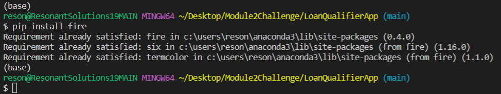
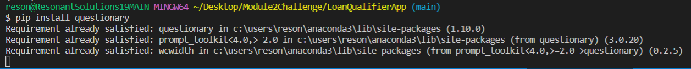
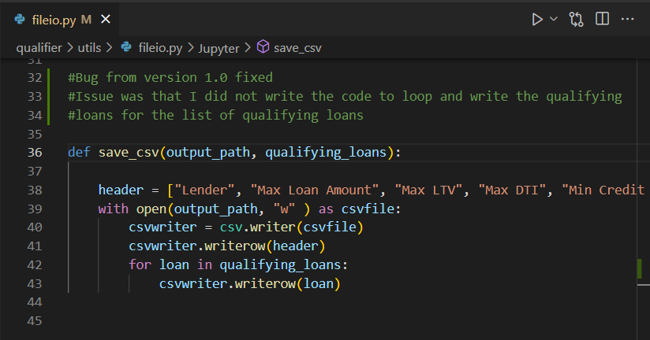
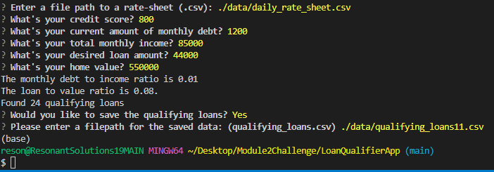
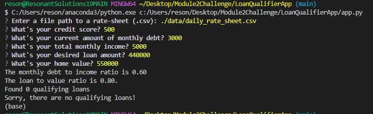
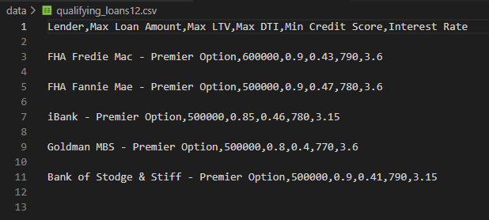

# Loan Qualifier App - Ver 1.2

<!-- TABLE OF CONTENTS -->

  
Table of Contents

  <ol>
    <li>
      <a href="#purpose">Purpose</a>
      <ul>
        <li><a href="#inputs">Inputs</a></li>
        <li><a href="#outputs">Outputs</a></li>
      </ul>
    </li>
    <li>
      <a href="#technologies">Technologies</a>
      <ul>
        <li><a href="#python">Python</a></li>
        <li><a href="#libraries">Libraries</a></li>
      </ul>
    </li>
    <li><a href="#version-release">Version Release</a></li>
    <li><a href="#installation-guide">Installation Guide</a></li>
    <li><a href="#usage">Usage</a></li>
    <li><a href="#contributors">Contributors</a></li>
    <li><a href="#license">License</a></li>
        <ul>
        <li><a href="#permissions">Permissions</a></li>
        <li><a href="#disclaimer">Disclaimer</a></li>
        </ul>
    </li>
    <li><a href="#aknowledgements">Aknowledgements</a></li>

<!--Purpose -->
## Purpose
This application is designed to provide decision support managers of financial institutions that need to determine which loans will be offered to a customer (borrower) seeking a loan.

### Inputs
The application requires the entry of the the borrower's financial informaion metrics: 

    - Credit Score
    - Income
    - Current Debt
    - Desired loan amount

The Loan Qualifier App then returns the loans that the borrower qualifies for based on a specific lending criteria or business rules. 

The lending criteria uses the borrower's "credit score", "loan amount", and the borrower's calculated "debt to income ratio", and "loan to value ratio".
### Outputs
    If there are loans available to the borrower, a list will be saved and provided. 
    If there are no loans available. A tactful message is displayed indicating that no loans are available.

---
<!--Technologies -->
## Technologies
### Python

    Phyton Version: **3.7.13**

### Libraries & Packages: 
   **csv**, **cys**, **pathlib**, **fire**, **questionary**

### Library Links:
**[Pathlib](https://docs.python.org/3/library/pathlib.html), [Fire](https://github.com/google/python-fire), [Questionary](https://pypi.org/project/questionary/)**

---
<!--Installation Guide -->
## Installation Guide

1. Clone the file from GIT
2. Save the file to a folder that you can find easily
3. Install libraries and packages

    ## Python Fire: 
    Fire is a library for automatically generating command line interfaces (CLIs) for any Pyhon object.
    See more information here
    
        https://github.com/google/python-fire
    
    Installation:

        Install Python Fire with pip, run: 
        pip install fire

        When installed, the terminal should return something similar to:
      

    ## Python Questionary: 
        pip intall questionary
      
      When installed, the terminal should return something similar to:
      
4. Run the application

---
<!--Version Release -->
## Version Release

### Version 1.2 has corrected the bug

---
<!--Usage -->
## Usage

### Sample - Borrower qualifies for loans:

### Sample - Borrower does not qualify for any loan:

### Output file containing qualifying loans should look like this:

---
<!--Contributors -->
## Contributors

Jeremy Vargas

    Managing Director
    Resonant Solutions LLC
    email:    jeremyvargas@resonantsolutions.org
    linkedin: https://www.linkedin.com/in/jeremyvargas/

UW FinTech Bootcamp
- Instructors and TA's (Charles Xia)
- Startup code provided by institution

---
<!--License -->
## License
Loan Qualifier App is available under an MIT License.

Copyright (c) 2022 - Resonant Solutions, LLC

### Permissions
Permission is hereby granted, free of charge, to any person obtaining a copy of this software and associated documentation files (the “Software”), to deal in the Software without restriction, including without limitation the rights to use, copy, modify, merge, publish, distribute, sublicense, and/or sell copies of the Software, and to permit persons to whom the Software is furnished to do so, subject to the following conditions:

The above copyright notice and this permission notice shall be included in all copies or substantial portions of the Software.
### Disclaimer
The Software is provided “as is”, without warranty of any kind, express or implied, including but not limited to the warranties of merchantability, fitness for a particular purpose and noninfringement. In no event shall the authors or copyright holders be liable for any claim, damages or other liability, whether in an action of contract, tort or otherwise, arising from, out of or in connection with the software or the use or other dealings in the Software.

---
<!--Aknowledgements -->
## Aknowledgements
* [Markdown Guide](https://www.markdownguide.org/basic-syntax/#reference-style-links)

<!-- MARKDOWN LINKS & IMAGES -->
<!-- https://www.markdownguide.org/basic-syntax/#reference-style-links -->